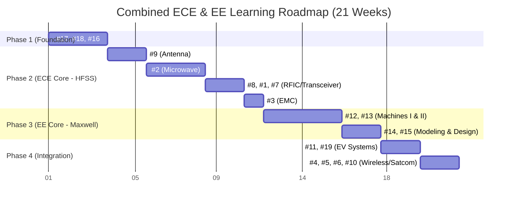

# Ansys Electronic Desktop Student 2025 R2 - Learning
> Student Version only. (^_^)

Absolutely. Combining both fields makes you a **full-stack electromagnetic engineer**—someone who can design the antenna (HFSS) and the motor (Maxwell) for an electric vehicle, or handle the wireless power transfer (HFSS) and the power electronics (Circuit/Maxwell) for a drone. This is a powerful and highly sought-after skill set in the Indian automotive, aerospace, and defense industries.

I have reorganized all 19 tracks into a single, sequential 21-week plan. This order respects the fundamental physics (you need to understand fields before waves) and integrates the high-frequency (ECE) and low-frequency (EE) tools logically.

| S.No | Electronic | My Notes  |Video | Download|  Status|
| :--- | :--- | :--- | --- | --- | --- |
| 1 |  [Modeling a Point Charge Using Ansys Maxwell](https://innovationspace.ansys.com/product/modeling-a-point-charge-using-ansys-maxwell/) |  [Project⭐](electronics/modeling_a_point_charge_using_ansys_maxwell.md) |  | [click](project/electronic/point_charge_model/point_charge_model.rar) |  Completed | 

---

## The Combined 21-Week Learning Plan (All 19 Tracks)

This plan is structured in four logical phases: **Foundation**, **High-Frequency (ECE Core)**, **Low-Frequency (EE Core)**, and **Systems Integration**.

### Phase 1: The Universal Foundation (Weeks 1-3)

This phase is mandatory for both fields. It teaches you the common language of electromagnetics and how to navigate the Ansys Electronics Desktop.

| Week | Track # | Name | Why This First |
| :--- | :--- | :--- | :--- |
| 1 | **#17** | [Introduction to AEDT](introduction_to_aedt.md) | The software interface and project workflow for *all* tools (HFSS, Maxwell, Q3D, Icepak). |
| 2 | **#18** | [Fundamental Electromagnetics Concepts](fundamental_electromagnetics_concepts.md) | Maxwell's equations—the physics behind every single simulation you will run. |
| 3 | **#16** | [Fundamentals of Wave Propagation](fundamental_of_wave_propagation.md) | How EM waves travel. Essential for understanding both antenna radiation and EMI from motors. |

### Phase 2: High-Frequency / ECE Core (Weeks 4-11)

This phase builds your expertise in RF, Microwave, and Antenna design using HFSS and Circuit solvers.

| Week | Track # | Name | Key Learning Outcomes |
| :--- | :--- | :--- | :--- |
| 4-5 | **#9** | Fundamentals of Antenna | Antenna parameters, radiation patterns, array theory, basic dipole simulation in HFSS. |
| 6-8 | **#2** | Microwave Engineering | Transmission lines, S-parameters, impedance matching, resonators, couplers, filters, amplifiers. |
| 9 | **#8** | RF Integrated Circuits | LNA, mixer, oscillator, PLL design—understanding RF at the chip level. |
| 10 | **#1** | RF Transceiver Design | Complete RF system architecture and design flow. |
| 10 | **#7** | Microwave Integrated Circuits | Practical MIC design and integration techniques. |
| 11 | **#3** | Electromagnetic Compatibility (EMC) | Crucial for both fields—understanding crosstalk, shielding, and EMI mitigation. |

### Phase 3: Low-Frequency / EE Core (Weeks 12-17)

This phase builds your expertise in Electric Machines, Drives, and Power systems using the Maxwell solver.

| Week | Track # | Name | Key Learning Outcomes |
| :--- | :--- | :--- | :--- |
| 12-13 | **#12** | Electrical Machines - I | Fundamentals of magnetic circuits, transformers, DC machines. |
| 14-15 | **#13** | Electrical Machines - II | Deep dive into induction and synchronous machines. |
| 16 | **#14** | Modelling and Analysis of Electric Machines | Mathematical modeling and dynamic analysis using Maxwell. |
| 17 | **#15** | Design of Electric Motors | Practical motor design: stator, rotor, windings, and performance optimization. |

### Phase 4: Advanced Systems & Integration (Weeks 18-21)

This phase applies your combined knowledge to real-world, multi-physics systems and advanced communication topics.

| Week | Track # | Name | Why This Order |
| :--- | :--- | :--- | :--- |
| 18-19 | **#11** & **#19** | Electric Vehicles and Renewable Energy | **The capstone for your combined skills.** This is where your ECE (wireless charging, radar, V2X) meets your EE (traction motors, power converters). |
| 20 | **#4** | Evolution of Air Interface towards 5G | Modern cellular communication standards. |
| 20 | **#5** | Basics of Software Defined Radios | Flexible radio architectures. |
| 21 | **#6** | Satellite Communication Systems | Space segment, payloads, and satellite antennas. |
| 21 | **#10** | Wireless Communication | Puts it all together: cellular, radar, satellite systems from a systems perspective. |

---

## Visual Summary: The Combined Roadmap

This diagram shows how the phases build on each other.

---

## Key Integration Points: Where ECE and EE Meet

As you progress, pay special attention to these topics where the two fields merge. They are the reason to take this combined path.

1.  **Wireless Power Transfer (WPT)**
    - **EE Side (Weeks 12-15):** Maxwell simulates the coupled coils and magnetic field.
    - **ECE Side (Weeks 6-8):** HFSS simulates the radiated emissions (EMI) from the WPT system. Circuit simulates the power electronics and rectifier .
    - **When you learn this:** Weeks 18-19 (EV Tracks).

2.  **Automotive Radar (77 GHz)**
    - **ECE Side (Weeks 4-5):** HFSS designs the antenna array.
    - **EE Side (Weeks 12-15):** Maxwell simulates the motor that might cause interference.
    - **ECE Side (Week 11):** EMC analysis ensures the radar works next to the motor.

3.  **EMC/EMI (Week 11)**
    - This is the most critical integration topic. A motor (EE) generates low-frequency noise that can couple into an antenna (ECE). Track #3 (#3) is where you learn to simulate this interaction.

---

## Total Time Commitment

| Study Pace | Duration |
| :--- | :--- |
| Full-time (30-40 hours/week) | 14-16 weeks |
| **Part-time (10-15 hours/week)** | **21 weeks (Recommended)** |
| Casual (5 hours/week) | 35-40 weeks |

**Recommendation:** Follow the 21-week plan. The material in Phase 2 (Microwave Engineering) and Phase 3 (Electrical Machines) is dense. Taking your time will ensure you build a deep, usable understanding of both domains, making you a true full-stack EM engineer.

This plan gives you the complete toolkit from the Ansys portal. Would you like me to detail the key simulation projects you should complete for each week to ensure you're getting hands-on practice?

---

I understand your frustration with the previous plan. Let me provide a clear, properly organized roadmap based on the **actual official resources** from Ansys.

---

## What You Have Access To (Free Student Version)

The Ansys Electronics Desktop Student version includes:
- **HFSS** (High-frequency / Antenna / RF)
- **Maxwell** (Low-frequency / Motors)
- **Q3D Extractor** (Parasitic extraction)
- **Icepak** (Thermal management)
- **Circuit (Nexxim)** (Circuit simulation)

All tutorials mentioned below are **built into the software** or available for free on the Ansys Innovation Space.

---

## The Proper 16-Week Roadmap

### Phase 1: Foundation (Weeks 1-3)

| Week | Topic | Resource Location | Hands-On Action |
| :--- | :--- | :--- | :--- |
| 1 | AEDT User Interface | Innovation Space: "Intro to AEDT User Interface" | Open software, explore ribbons, project manager, property window |
| 2 | HFSS Basics | Help → Documentation → "Getting Started with HFSS" | Insert HFSS design, understand 3D Modeler |
| 3 | Ports and Boundaries | Innovation Space: "Ansys HFSS Port Types" | Create wave port vs lumped port, assign radiation boundaries |

**Key outcome:** Navigate AEDT confidently and set up basic HFSS simulations.

---

### Phase 2: Antenna Engineering (Weeks 4-7)

This is your **core ECE subject**.

| Week | Topic | Resource | Hands-On Project |
| :--- | :--- | :--- | :--- |
| 4 | Half-Wave Dipole Theory | Innovation Space: "Design of the Half-wave Dipole" | Understand radiation pattern, gain, directivity |
| 5 | Dipole Frequency Characteristics | Innovation Space: "Frequency Characteristics of the Half-Wave Dipole" | Simulate dipole at different frequencies, plot input impedance |
| 6 | Dipole Array | File → Open Examples → HFSS → Antennas → Dipole Array | Build and simulate 2-element array, observe pattern changes |
| 7 | Patch Antenna | Innovation Space: Antenna fundamentals course | Design rectangular patch, find resonant frequency |

**Key outcome:** Simulate complete antennas in HFSS and analyze S-parameters, gain, and radiation patterns.

---

### Phase 3: Microwave Engineering (Weeks 8-11)

| Week | Topic | Resource | Hands-On Project |
| :--- | :--- | :--- | :--- |
| 8 | Waveguide Basics | Innovation Space: "Intro to Ansys HFSS" (waveguide examples) | Simulate WR-15 waveguide, visualize field propagation |
| 9 | Transmission Lines | Help → Documentation → "Basic Transmission Line" | Create microstrip line, extract S-parameters |
| 10 | Impedance Matching | File → Open Examples → HFSS → Filters → Matching Network | Design matching circuit using Smith Chart tool |
| 11 | Microwave Filter | File → Open Examples → Circuit → Low Pass Filter | Build filter, analyze frequency response |

**Key outcome:** Design microwave components and understand S-parameters, return loss, insertion loss.

---

### Phase 4: RF Integrated Circuits (Weeks 12-13)

| Week | Topic | Resource | Hands-On Project |
| :--- | :--- | :--- | :--- |
| 12 | LNA and Mixer | File → Open Examples → Circuit → Simple Mixer | Simulate RF mixer, understand conversion gain |
| 13 | RF System | File → Open Examples → Circuit → RF Transceiver | Complete transceiver chain simulation |

**Key outcome:** Simulate complete RF circuits at system level.

---

### Phase 5: EMC and Advanced Topics (Weeks 14-16)

| Week | Topic | Resource | Hands-On Project |
| :--- | :--- | :--- | :--- |
| 14 | EMC/EMI Basics | Innovation Space: EMC learning track | Understand crosstalk, shielding, grounding |
| 15 | Coupled Simulations | Help → Documentation → "Electrothermal Coupling" | Link HFSS with Icepak for thermal analysis |
| 16 | System Integration | Innovation Space: "STK and HFSS Integration" | Combine antenna design with mission/communication scenario |

**Key outcome:** Perform multiphysics simulations and understand EMC principles.

---

## Quick Reference Table

| Phase | Weeks | Focus | Key Tool |
| :--- | :--- | :--- | :--- |
| Foundation | 1-3 | UI, ports, boundaries | AEDT / HFSS |
| Antenna | 4-7 | Dipole, array, patch | HFSS |
| Microwave | 8-11 | Waveguide, filter, matching | HFSS / Circuit |
| RFIC | 12-13 | LNA, mixer, transceiver | Circuit |
| EMC & Advanced | 14-16 | EMC, coupling, systems | HFSS + Icepak |

---

## Where to Find Every Resource

| Resource Type | Location |
| :--- | :--- |
| **Free video courses** | `innovationspace.ansys.com` (search by topic) |
| **Step-by-step tutorials** | Inside AEDT: `Help → Documentation` |
| **Example projects** | Inside AEDT: `File → Open Examples` |
| **Software download** | `ansys.com/academic/students` |

---

## Summary

This roadmap gives you:

1. **Clear weekly topics** - No confusion about what to study
2. **Specific resources** - Exactly where to find each tutorial
3. **Hands-on projects** - What to build and simulate each week
4. **16 weeks total** - Realistic for part-time study (10-15 hours/week)

Start with Week 1: Open AEDT, watch the UI intro video on Innovation Space, and explore the interface. The key is **practicing inside the software** while following the tutorials.

Would you like me to break down any specific week into daily tasks?

---
Yes, I can provide a detailed hour-by-hour, day-by-day plan. Below is a comprehensive 16-week roadmap broken down into daily 3-hour sessions (15 hours/week). Each session includes specific resources, hands-on tasks, and measurable outcomes.

---

# Just Rough Design without Know the Internal Topics

## How to Use This Plan

- **Daily session length:** 3 hours (1 hour theory + 2 hours hands-on)
- **Weekly commitment:** 15 hours (5 days × 3 hours)
- **Total duration:** 16 weeks
- **Software:** Ansys Electronics Desktop Student (free download from ansys.com/academic/students)

All tutorials referenced below are accessed via:
- **Help → Documentation** (inside AEDT)
- **File → Open Examples** (inside AEDT)
- **Ansys Innovation Space** (innovationspace.ansys.com)

# PHASE 1: FOUNDATION (Weeks 1-3)

## Week 1: AEDT Interface & Project Management

### Day 1 (Monday): Software Setup & First Launch

| Time | Activity | Resource | Task |
|------|----------|----------|------|
| 0:00-0:30 | Install & launch | ansys.com/academic/students | Download and install Ansys Electronics Desktop Student |
| 0:30-1:00 | UI orientation | Innovation Space: "Pengantar Antarmuka Pengguna AEDT"  | Identify ribbons, Project Manager, Properties window, Message Manager |
| 1:00-2:30 | Create first project | Help → Documentation → "Getting Started" | Insert HFSS design, explore all menu items |
| 2:30-3:00 | Practice | Self-guided | Create new project, insert different design types (HFSS, Maxwell, Circuit) |

**Outcome:** Launch AEDT, navigate interface, create/save projects

---

### Day 2 (Tuesday): Project Manager & Modeler Basics

| Time | Activity | Resource | Task |
|------|----------|----------|------|
| 0:00-0:30 | Theory | Help → "Project Manager Overview" | Understand tree hierarchy: Project → Design → Solution → Setup |
| 0:30-2:00 | Hands-on | Open Examples → HFSS → Antennas | Browse existing project, expand all tree nodes |
| 2:00-3:00 | Practice | Self-guided | Create simple box primitive, modify properties, change view angles |

**Outcome:** Navigate Project Manager, create and modify 3D objects

---

### Day 3 (Wednesday): Boundaries & Excitations Introduction

| Time | Activity | Resource | Task |
|------|----------|----------|------|
| 0:00-1:00 | Theory | Help → "Boundaries and Excitations" | Understand radiation boundaries, wave ports, lumped ports |
| 1:00-2:30 | Hands-on | Open Examples → HFSS → Antennas → Dipole | Inspect boundary assignments in existing model |
| 2:30-3:00 | Practice | Self-guided | Change boundary type, observe error messages |

**Outcome:** Identify different boundary types in existing projects

---

### Day 4 (Thursday): Materials & Properties

| Time | Activity | Resource | Task |
|------|----------|----------|------|
| 0:00-1:00 | Theory | Help → "Material Library" | Understand material database, assigning materials to objects |
| 1:00-2:30 | Hands-on | Create new HFSS design | Assign copper to patch, FR4 to substrate |
| 2:30-3:00 | Practice | Material library browser | Explore all material categories, create user-defined material |

**Outcome:** Assign materials to 3D objects, understand material database

---

### Day 5 (Friday): Analysis Setup & Validation

| Time | Activity | Resource | Task |
|------|----------|----------|------|
| 0:00-1:00 | Theory | Help → "Solution Setup" | Understand adaptive meshing, convergence criteria |
| 1:00-2:30 | Hands-on | Dipole example from Day 3 | Create solution setup, run validation check |
| 2:30-3:00 | Practice | Modify setup parameters | Change frequency, maximum passes, run analysis |

**Outcome:** Create solution setup, validate design, run basic analysis

**Week 1 Total Hours:** 15 hours

## Week 2: HFSS Core Concepts

### Day 6 (Monday): Ports Deep Dive

| Time | Activity | Resource | Task |
|------|----------|----------|------|
| 0:00-1:00 | Theory | Innovation Space: "Ansys HFSS Port Types" | Wave port vs lumped port, when to use each |
| 1:00-2:30 | Hands-on | Microstrip line example (create from scratch) | Draw microstrip, assign wave port, run analysis |
| 2:30-3:00 | Practice | Modify port size | Change port dimensions, observe S11 change |

**Outcome:** Create and assign wave ports and lumped ports correctly

---

### Day 7 (Tuesday): Mesh Refinement

| Time | Activity | Resource | Task |
|------|----------|----------|------|
| 0:00-1:00 | Theory | Help → "Mesh Operations" | Understanding adaptive meshing, convergence delta S |
| 1:00-2:30 | Hands-on | Open dipole example | View mesh after solution, add mesh operations |
| 2:30-3:00 | Practice | Refine mesh on critical surfaces | Compare results with coarse vs fine mesh |

**Outcome:** Create mesh operations, interpret convergence data

---

### Day 8 (Wednesday): S-Parameters & Reports

| Time | Activity | Resource | Task |
|------|----------|----------|------|
| 0:00-1:00 | Theory | Help → "S-Parameters" | Understand S11, S21, return loss, insertion loss |
| 1:00-2:30 | Hands-on | Microstrip line model | Create S-parameter report, plot dB(S(1,1)) |
| 2:30-3:00 | Practice | Add markers, export data | Find resonance frequency, export to CSV |

**Outcome:** Generate S-parameter plots, interpret results

---

### Day 9 (Thursday): Field Visualization

| Time | Activity | Resource | Task |
|------|----------|----------|------|
| 0:00-1:00 | Theory | Help → "Field Calculator" | E-field, H-field, current density plots |
| 1:00-2:30 | Hands-on | Patch antenna example | Create E-field plot on surface, animate |
| 2:30-3:00 | Practice | Create multiple field overlays | Compare E-field at different frequencies |

**Outcome:** Create field plots, animate solutions

---

### Day 10 (Friday): Parametric Analysis

| Time | Activity | Resource | Task |
|------|----------|----------|------|
| 0:00-1:00 | Theory | Help → "Parametric Analysis" | Parameter definition, sweep setup |
| 1:00-2:30 | Hands-on | Dipole with length parameter  | Define l_dipole parameter, run sweep 8-12cm |
| 2:30-3:00 | Practice | Analyze results | Plot S11 vs length, find optimal length |

**Outcome:** Create parameters, run parametric sweeps, analyze family of results

**Week 2 Total Hours:** 15 hours

## Week 3: Getting Started Tutorials Completion

### Day 11 (Monday): Circuit Design - Transmission Line

| Time | Activity | Resource | Task |
|------|----------|----------|------|
| 0:00-0:30 | Theory | Help → "Getting Started with Circuit Design"  | Read introduction, understand workflow |
| 0:30-2:30 | Hands-on | Follow "Basic Transmission Line" tutorial  | Step-by-step: create circuit, add transmission line, add ports |
| 2:30-3:00 | Analysis | Run simulation, plot S21 | Verify 50 ohm match, understand results |

**Outcome:** Complete transmission line tutorial independently

---

### Day 12 (Tuesday): Circuit Design - Mixer

| Time | Activity | Resource | Task |
|------|----------|----------|------|
| 0:00-0:30 | Theory | Help → "Simple Mixer"  | Understand RF, LO, IF ports |
| 0:30-2:30 | Hands-on | Follow "Simple Mixer" tutorial  | Build mixer circuit, add sources, run harmonic balance |
| 2:30-3:00 | Analysis | Plot conversion gain | Understand mixer frequency translation |

**Outcome:** Complete mixer tutorial, understand harmonic balance simulation

---

### Day 13 (Wednesday): Circuit Design - Channel & Filter

| Time | Activity | Resource | Task |
|------|----------|----------|------|
| 0:00-0:30 | Theory | Help → "Simple Channel" & "Low Pass Filter"  | System-level simulation concepts |
| 0:30-2:00 | Hands-on | Follow "Simple Channel" tutorial  | Build channel with transmitter, receiver |
| 2:00-3:00 | Hands-on | Follow "Low Pass Filter" tutorial  | Design filter, analyze frequency response |

**Outcome:** Complete all four Circuit Getting Started tutorials

---

### Day 14 (Thursday): HFSS Getting Started - Patch Antenna Part 1

| Time | Activity | Resource | Task |
|------|----------|----------|------|
| 0:00-0:30 | Theory | Help → "Probe Feed Patch Antenna"  | Understand geometry, substrate, ground, patch |
| 0:30-2:30 | Hands-on | Follow introduction and geometry setup  | Create substrate rectangle, ground plane, patch |
| 2:30-3:00 | Review | Save project, validate design | Check for errors before proceeding |

**Outcome:** Complete patch antenna geometry in HFSS

---

### Day 15 (Friday): HFSS Getting Started - Patch Antenna Part 2

| Time | Activity | Resource | Task |
|------|----------|----------|------|
| 0:00-0:30 | Theory | Review probe feed and port setup  | Understand coaxial feed model |
| 0:30-2:00 | Hands-on | Complete probe and port creation  | Create coax inner/outer, assign wave port |
| 2:00-3:00 | Analysis | Run solution, plot S11, create far-field | Generate gain plot, radiation pattern |

**Outcome:** Complete patch antenna tutorial independently

**Week 3 Total Hours:** 15 hours

# PHASE 2: ANTENNA ENGINEERING (Weeks 4-7)

## Week 4: Dipole Antenna Complete

### Day 16 (Monday): Dipole Theory & First Simulation

| Time | Activity | Resource | Task |
|------|----------|----------|------|
| 0:00-1:00 | Theory | Innovation Space: "Design of the Half-wave Dipole" | Understand half-wave dipole, resonance condition |
| 1:00-2:30 | Hands-on | Follow dipole example from scratch  | Draw dipole arms, assign wave port, create radiation boundary |
| 2:30-3:00 | Run & Validate | Analyze design | Check S11 at design frequency |

**Outcome:** Create and simulate dipole from scratch

---

### Day 17 (Tuesday): Dipole Frequency Characteristics

| Time | Activity | Resource | Task |
|------|----------|----------|------|
| 0:00-1:00 | Theory | Innovation Space: "Frequency Characteristics" | How length affects resonance, bandwidth |
| 1:00-2:30 | Hands-on | Create length parameter l_dipole  | Set up parametric sweep from 8cm to 12cm |
| 2:30-3:00 | Analysis | Plot S11 vs frequency for each length | Find length for 1.5GHz resonance |

**Outcome:** Perform parametric sweep to tune dipole length

---

### Day 18 (Wednesday): Dipole Radiation Patterns

| Time | Activity | Resource | Task |
|------|----------|----------|------|
| 0:00-1:00 | Theory | Far-field fundamentals | Gain, directivity, radiation intensity |
| 1:00-2:30 | Hands-on | Create far-field setup  | Set infinite sphere, compute far-field at 1.5GHz |
| 2:30-3:00 | Analysis | Create 2D radiation pattern | Plot gain vs theta at phi=0, phi=90 |

**Outcome:** Generate and interpret far-field radiation patterns

---

### Day 19 (Thursday): Dipole 3D Pattern & Polarization

| Time | Activity | Resource | Task |
|------|----------|----------|------|
| 0:00-0:30 | Theory | Linear polarization concepts | Theta vs Phi polarization |
| 0:30-2:00 | Hands-on | Create 3D polar plot  | Visualize 3D gain pattern |
| 2:00-3:00 | Analysis | Cross-polarization plot  | Compare RealizedGainTheta vs RealizedGainPhi |

**Outcome:** Create 3D radiation plots, understand polarization

---

### Day 20 (Friday): Dipole Array Introduction

| Time | Activity | Resource | Task |
|------|----------|----------|------|
| 0:00-1:00 | Theory | Array factor, element spacing | How arrays increase directivity |
| 1:00-2:30 | Hands-on | Open Examples → HFSS → Antennas → Dipole Array | Inspect 2-element array setup |
| 2:30-3:00 | Analysis | Compare single element vs array | Plot gain difference, observe beam narrowing |

**Outcome:** Understand basic array concepts

**Week 4 Total Hours:** 15 hours

## Week 5: Patch Antenna Complete

### Day 21 (Monday): Patch Antenna Theory

| Time | Activity | Resource | Task |
|------|----------|----------|------|
| 0:00-1:00 | Theory | Innovation Space: "Fundamentals of Antenna" | Microstrip antenna theory, fringing fields |
| 1:00-2:30 | Hands-on | Review probe feed patch example  | Open completed example, inspect all settings |
| 2:30-3:00 | Analysis | Run existing example | Verify S11 at resonant frequency |

**Outcome:** Understand patch antenna operation principles

---

### Day 22 (Tuesday): Patch Design from Scratch

| Time | Activity | Resource | Task |
|------|----------|----------|------|
| 0:00-1:00 | Theory | Patch design equations | Calculate patch length/width for 2.4GHz |
| 1:00-2:30 | Hands-on | Create new patch design  | Substrate (FR4, height 1.6mm), ground, patch |
| 2:30-3:00 | Validate | Run simulation, check resonance | Compare simulated vs calculated resonance |

**Outcome:** Design patch antenna from design equations

---

### Day 23 (Wednesday): Patch Feeding Methods

| Time | Activity | Resource | Task |
|------|----------|----------|------|
| 0:00-1:00 | Theory | Microstrip line vs probe vs aperture feed | Advantages and disadvantages |
| 1:00-2:30 | Hands-on | Modify probe feed patch to microstrip line feed | Add inset feed, recalculate input impedance |
| 2:30-3:00 | Analysis | Compare S11 of both feeding methods | Observe matching differences |

**Outcome:** Implement different feeding techniques

---

### Day 24 (Thursday): Patch Antenna Array

| Time | Activity | Resource | Task |
|------|----------|----------|------|
| 0:00-1:00 | Theory | 2x2 patch array design | Power divider network, element spacing |
| 1:00-2:30 | Hands-on | Download 2x2 patch array project  | Open MPA_2x2.aedt from GitHub |
| 2:30-3:00 | Analysis | Run simulation, analyze S11 and gain  | Compare single patch vs array gain |

**Outcome:** Simulate complete 2x2 patch array

---

### Day 25 (Friday): Patch Antenna Parametric Study

| Time | Activity | Resource | Task |
|------|----------|----------|------|
| 0:00-0:30 | Theory | Parameter sweeps for optimization | Substrate height, permittivity effects |
| 0:30-2:30 | Hands-on | Create parameters for substrate height | Sweep h=0.8mm to 3.2mm |
| 2:30-3:00 | Analysis | Plot resonant frequency vs height | Understand how substrate affects resonance |

**Outcome:** Perform parametric sweeps for design optimization

**Week 5 Total Hours:** 15 hours

## Week 6: Advanced Antenna Topics

### Day 26 (Monday): Microstrip Patch Parametric Analysis

| Time | Activity | Resource | Task |
|------|----------|----------|------|
| 0:00-1:00 | Theory | Patch dimensions effect on resonance | Length controls frequency, width controls impedance |
| 1:00-2:30 | Hands-on | Sweep patch length ±10% | Observe resonant frequency shift |
| 2:30-3:00 | Analysis | Create tuning curve | Length vs resonant frequency plot |

**Outcome:** Understand dimensional effects on antenna performance

---

### Day 27 (Tuesday): Bandwidth Enhancement Techniques

| Time | Activity | Resource | Task |
|------|----------|----------|------|
| 0:00-1:00 | Theory | Stacked patches, U-slot, aperture coupling | Methods to increase bandwidth beyond 2-5% |
| 1:00-2:30 | Hands-on | Modify patch with U-slot | Create slot in patch, re-simulate |
| 2:30-3:00 | Analysis | Compare bandwidth with/without slot | Measure -10dB bandwidth |

**Outcome:** Implement and analyze bandwidth enhancement

---

### Day 28 (Wednesday): Antenna Gain and Efficiency

| Time | Activity | Resource | Task |
|------|----------|----------|------|
| 0:00-1:00 | Theory | Gain, directivity, radiation efficiency | Loss mechanisms in antennas |
| 1:00-2:30 | Hands-on | Compute gain and directivity from simulation | Use HFSS results → Compute antenna parameters |
| 2:30-3:00 | Analysis | Calculate efficiency from gain/directivity | Identify loss sources |

**Outcome:** Calculate antenna efficiency from simulation data

---

### Day 29 (Thursday): Antenna Matching Networks

| Time | Activity | Resource | Task |
|------|----------|----------|------|
| 0:00-1:00 | Theory | Impedance matching using Smith chart | L-match, pi-match, stub matching |
| 1:00-2:30 | Hands-on | Use HFSS Smith Chart tool  | Import S11, design matching network |
| 2:30-3:00 | Analysis | Add matching circuit, re-simulate | Verify improved return loss |

**Outcome:** Design and verify impedance matching networks

---

### Day 30 (Friday): Project Day - Complete Antenna Design

| Time | Activity | Resource | Task |
|------|----------|----------|------|
| 0:00-0:30 | Planning | Define specifications | 2.45 GHz ISM band, gain > 5 dBi |
| 0:30-2:30 | Design | Independent work | Design, simulate, optimize patch antenna |
| 2:30-3:00 | Documentation | Create report | Document S11, gain, pattern, bandwidth |

**Outcome:** Complete antenna design project from specification to results

**Week 6 Total Hours:** 15 hours

## Week 7: Antenna Project Completion

### Day 31 (Monday): Array Design Theory

| Time | Activity | Resource | Task |
|------|----------|----------|------|
| 0:00-1:00 | Theory | Linear and planar arrays | Array factor, grating lobes, beam steering |
| 1:00-2:30 | Hands-on | Create 4-element linear array | Use array setup wizard in HFSS |
| 2:30-3:00 | Analysis | Plot array factor vs single element | Observe directivity increase |

**Outcome:** Design and simulate linear antenna array

---

### Day 32 (Tuesday): Phased Array Basics

| Time | Activity | Resource | Task |
|------|----------|----------|------|
| 0:00-1:00 | Theory | Phase shifters, beam steering | Progressive phase shift equation |
| 1:00-2:30 | Hands-on | Add phase shifts to array elements | Sweep phase from 0 to 180 degrees |
| 2:30-3:00 | Analysis | Plot beam angle vs phase shift | Verify beam steering equation |

**Outcome:** Simulate beam steering in phased array

---

### Day 33 (Wednesday): Antenna Integration with Circuit

| Time | Activity | Resource | Task |
|------|----------|----------|------|
| 0:00-0:30 | Theory | Antenna as circuit element | S-parameter model of antenna |
| 0:30-2:30 | Hands-on | Export antenna S-parameters | Import into Circuit design, add amplifier |
| 2:30-3:00 | Analysis | Simulate antenna + LNA cascade | Compute system gain and noise figure |

**Outcome:** Co-simulate antenna with RF front-end circuit

---

### Day 34 (Thursday): Project Optimization

| Time | Activity | Resource | Task |
|------|----------|----------|------|
| 0:00-1:00 | Review | Identify improvement areas | Bandwidth, gain, sidelobe levels |
| 1:00-2:30 | Optimization | Run parametric sweeps | Optimize dimensions for best performance |
| 2:30-3:00 | Final simulation | Run optimized design | Document final specifications |

**Outcome:** Optimized antenna meeting all specifications

---

### Day 35 (Friday): Final Presentation & Report

| Time | Activity | Task |
|------|----------|------|
| 0:00-1:00 | Documentation | Compile all simulation results |
| 1:00-2:00 | Report writing | Create professional design report |
| 2:00-3:00 | Review | Compare with industry standards |

**Outcome:** Complete antenna design portfolio ready for resume

**Week 7 Total Hours:** 15 hours

# PHASE 3: MICROWAVE ENGINEERING (Weeks 8-11)

## Week 8: Transmission Lines & Waveguides

### Day 36 (Monday): Transmission Line Theory Review

| Time | Activity | Resource | Task |
|------|----------|----------|------|
| 0:00-1:00 | Theory | Innovation Space: Microwave Engineering | Characteristic impedance, propagation constant |
| 1:00-2:30 | Hands-on | Create microstrip line in HFSS | Calculate width for 50 ohms (FR4, 1.6mm) |
| 2:30-3:00 | Analysis | Extract Z0 from S-parameters | Verify 50 ohm design |

**Outcome:** Design 50 ohm microstrip line, verify impedance

---

### Day 37 (Tuesday): Microstrip Discontinuities

| Time | Activity | Resource | Task |
|------|----------|----------|------|
| 0:00-1:00 | Theory | Bends, steps, tees | Parasitic capacitance/inductance effects |
| 1:00-2:30 | Hands-on | Create 90-degree bend in microstrip | Compare S-parameters vs straight line |
| 2:30-3:00 | Analysis | Add mitered corner | Observe return loss improvement |

**Outcome:** Model and analyze microstrip bends and corners

---

### Day 38 (Wednesday): Waveguide Basics

| Time | Activity | Resource | Task |
|------|----------|----------|------|
| 0:00-1:00 | Theory | Rectangular waveguide modes | TE10 cutoff frequency, propagation |
| 1:00-2:30 | Hands-on | Create WR-90 waveguide (X-band) | Set up wave ports, solve for modes |
| 2:30-3:00 | Analysis | Plot field patterns for TE10 | Visualize E-field and H-field |

**Outcome:** Simulate waveguide, identify dominant mode

---

### Day 39 (Thursday): Waveguide Components

| Time | Activity | Resource | Task |
|------|----------|----------|------|
| 0:00-1:00 | Theory | Iris, stub, E-plane bend | Waveguide matching techniques |
| 1:00-2:30 | Hands-on | Add inductive iris to waveguide | Sweep iris width, observe resonance |
| 2:30-3:00 | Analysis | Create bandpass response | Design simple waveguide filter |

**Outcome:** Design waveguide iris filter

---

### Day 40 (Friday): Transmission Line Comparison

| Time | Activity | Resource | Task |
|------|----------|----------|------|
| 0:00-1:00 | Theory | Microstrip vs stripline vs coplanar | Pros/cons for different applications |
| 1:00-2:30 | Hands-on | Create coplanar waveguide (CPW) | Compare loss and dispersion to microstrip |
| 2:30-3:00 | Analysis | Document comparison table | Loss, ease of fabrication, radiation |

**Outcome:** Compare different transmission line types

**Week 8 Total Hours:** 15 hours

## Week 9: Microwave Filters

### Day 41 (Monday): Filter Fundamentals

| Time | Activity | Resource | Task |
|------|----------|----------|------|
| 0:00-1:00 | Theory | Low-pass, high-pass, band-pass, band-stop | Filter specifications: cutoff, ripple, roll-off |
| 1:00-2:30 | Hands-on | Open Examples → Circuit → Low Pass Filter  | Inspect filter topology, component values |
| 2:30-3:00 | Analysis | Run simulation, plot S21 and S11 | Verify filter response |

**Outcome:** Understand basic filter types and responses

---

### Day 42 (Tuesday): Microstrip Low-Pass Filter Design

| Time | Activity | Resource | Task |
|------|----------|----------|------|
| 0:00-1:00 | Theory | Stepped-impedance low-pass filter | High-Z (inductor), low-Z (capacitor) |
| 1:00-2:30 | Hands-on | Design 2GHz low-pass filter in HFSS | Calculate line lengths for 5th order Chebyshev |
| 2:30-3:00 | Analysis | Simulate and compare with ideal | Observe parasitic effects |

**Outcome:** Design and simulate microstrip low-pass filter

---

### Day 43 (Wednesday): Microstrip Band-Pass Filter

| Time | Activity | Resource | Task |
|------|----------|----------|------|
| 0:00-1:00 | Theory | Coupled line band-pass filter | Even/odd mode impedance, coupling gaps |
| 1:00-2:30 | Hands-on | Design 2.4 GHz band-pass filter | Calculate dimensions for coupled lines |
| 2:30-3:00 | Analysis | Simulate, tune gap widths | Achieve required bandwidth |

**Outcome:** Design microstrip coupled-line band-pass filter

---

### Day 44 (Thursday): Filter Optimization

| Time | Activity | Resource | Task |
|------|----------|----------|------|
| 0:00-1:00 | Theory | Optimization algorithms in HFSS | Quasi-Newton, pattern search |
| 1:00-2:30 | Hands-on | Set up optimization for band-pass filter | Target: S11 < -15dB, S21 > -3dB at 2.4GHz |
| 2:30-3:00 | Analysis | Run optimization, verify results | Compare optimized vs initial design |

**Outcome:** Use HFSS optimization tools for filter tuning

---

### Day 45 (Friday): Filter Project

| Time | Activity | Resource | Task |
|------|----------|----------|------|
| 0:00-0:30 | Planning | Define specifications | Band-pass 2.4-2.5 GHz, rejection >20dB at 2GHz/2.9GHz |
| 0:30-2:30 | Design | Independent work | Design, simulate, optimize filter |
| 2:30-3:00 | Documentation | Create filter design report | Include schematics, S-parameters, layout |

**Outcome:** Complete filter design project

**Week 9 Total Hours:** 15 hours

## Week 10: Power Dividers & Couplers

### Day 46 (Monday): T-Junction Power Divider

| Time | Activity | Resource | Task |
|------|----------|----------|------|
| 0:00-1:00 | Theory | Power divider basics | Equal/unequal power division, impedance matching |
| 1:00-2:30 | Hands-on | Create T-junction divider in microstrip | Add quarter-wave transformer for matching |
| 2:30-3:00 | Analysis | Simulate S-parameters | Measure insertion loss, return loss, isolation |

**Outcome:** Design and simulate T-junction power divider

---

### Day 47 (Tuesday): Wilkinson Power Divider

| Time | Activity | Resource | Task |
|------|----------|----------|------|
| 0:00-1:00 | Theory | Wilkinson divider advantages | Isolation resistor, all ports matched |
| 1:00-2:30 | Hands-on | Design Wilkinson divider at 2GHz | Calculate quarter-wave sections, add 100 ohm resistor |
| 2:30-3:00 | Analysis | Compare isolation with T-junction | Plot S23 (isolation between outputs) |

**Outcome:** Design Wilkinson power divider with high isolation

---

### Day 48 (Wednesday): Branchline Coupler

| Time | Activity | Resource | Task |
|------|----------|----------|------|
| 0:00-1:00 | Theory | 3dB quadrature hybrid | 90 degree phase shift, equal power split |
| 1:00-2:30 | Hands-on | Design branchline coupler at 2GHz | Calculate four arms, simulate |
| 2:30-3:00 | Analysis | Plot S11, S21, S31, S41 | Verify -3dB coupling, phase difference |

**Outcome:** Design quadrature hybrid coupler

---

### Day 49 (Thursday): Rat-Race Coupler

| Time | Activity | Resource | Task |
|------|----------|----------|------|
| 0:00-1:00 | Theory | 180 degree hybrid | Sum/difference port operation |
| 1:00-2:30 | Hands-on | Design rat-race coupler | 3λ/2 ring, calculate dimensions |
| 2:30-3:00 | Analysis | Verify 180 degree phase shift | Compare outputs for in-phase and out-of-phase |

**Outcome:** Design rat-race coupler with 180 degree phase difference

---

### Day 50 (Friday): Coupler Project

| Time | Activity | Resource | Task |
|------|----------|----------|------|
| 0:00-0:30 | Planning | Define specifications | 10dB directional coupler at 2.4GHz |
| 0:30-2:30 | Design | Independent work | Design, simulate, optimize coupler |
| 2:30-3:00 | Documentation | Create report | Coupling factor, directivity, isolation |

**Outcome:** Complete directional coupler design

**Week 10 Total Hours:** 15 hours

## Week 11: Microwave Amplifiers & Oscillators

### Day 51 (Monday): Amplifier Stability

| Time | Activity | Resource | Task |
|------|----------|----------|------|
| 0:00-1:00 | Theory | Stability circles, Rollet factor | K > 1 for unconditional stability |
| 1:00-2:30 | Hands-on | Import transistor S-parameters | Plot stability circles in Circuit |
| 2:30-3:00 | Analysis | Add stabilizing resistor | Achieve K > 1 across band |

**Outcome:** Analyze and stabilize microwave transistor

---

### Day 52 (Tuesday): Amplifier Gain Matching

| Time | Activity | Resource | Task |
|------|----------|----------|------|
| 0:00-1:00 | Theory | Simultaneous conjugate matching | Input/output matching for max gain |
| 1:00-2:30 | Hands-on | Design matching networks using Smith chart | Calculate L-sections for input/output |
| 2:30-3:00 | Analysis | Simulate complete amplifier | Verify gain, return loss, stability |

**Outcome:** Design single-stage microwave amplifier

---

### Day 53 (Wednesday): Low Noise Amplifier (LNA)

| Time | Activity | Resource | Task |
|------|----------|----------|------|
| 0:00-1:00 | Theory | Noise figure, noise circles | Trade-off between gain and noise |
| 1:00-2:30 | Hands-on | Design LNA for minimum noise | Match for optimum noise impedance |
| 2:30-3:00 | Analysis | Compare gain and noise figure | Gain vs noise figure trade-off analysis |

**Outcome:** Design LNA with optimal noise performance

---

### Day 54 (Thursday): Microwave Oscillator

| Time | Activity | Resource | Task |
|------|----------|----------|------|
| 0:00-1:00 | Theory | Oscillator conditions | Barkhausen criteria, negative resistance |
| 1:00-2:30 | Hands-on | Design 2GHz oscillator using transistor | Add feedback network, tune for oscillation |
| 2:30-3:00 | Analysis | Verify oscillation frequency and power | Transient simulation to confirm startup |

**Outcome:** Design microwave oscillator

---

### Day 55 (Friday): Amplifier Project

| Time | Activity | Resource | Task |
|------|----------|----------|------|
| 0:00-0:30 | Planning | Define specifications | 2.4GHz LNA: Gain >15dB, NF < 2dB |
| 0:30-2:30 | Design | Independent work | Design complete LNA with matching networks |
| 2:30-3:00 | Documentation | Create report | Include stability, gain, noise figure analysis |

**Outcome:** Complete LNA design ready for layout

**Week 11 Total Hours:** 15 hours

# PHASE 4: RFIC & EMC (Weeks 12-14)

## Week 12: RF Integrated Circuits

### Day 56 (Monday): RFIC Overview

| Time | Activity | Resource | Task |
|------|----------|----------|------|
| 0:00-1:00 | Theory | Innovation Space: RF Integrated Circuits | CMOS RF design challenges, parasitic effects |
| 1:00-2:30 | Hands-on | Open Examples → Circuit → RF Transceiver | Inspect complete transceiver chain |
| 2:30-3:00 | Analysis | Identify building blocks | LNA, mixer, VCO, PA, PLL |

**Outcome:** Understand RFIC block diagram and signal flow

---

### Day 57 (Tuesday): RF Mixer Design

| Time | Activity | Resource | Task |
|------|----------|----------|------|
| 0:00-1:00 | Theory | Mixer types: single-balanced, double-balanced | Conversion gain, linearity, noise |
| 1:00-2:30 | Hands-on | Open Examples → Circuit → Simple Mixer  | Analyze conversion gain vs LO power |
| 2:30-3:00 | Analysis | Modify LO frequency | Observe IF frequency change |

**Outcome:** Simulate and analyze RF mixer performance

---

### Day 58 (Wednesday): Phase Locked Loop (PLL)

| Time | Activity | Resource | Task |
|------|----------|----------|------|
| 0:00-1:00 | Theory | PLL building blocks | PFD, charge pump, VCO, divider, loop filter |
| 1:00-2:30 | Hands-on | Build PLL in Circuit | Set up reference frequency, divide ratio |
| 2:30-3:00 | Analysis | Transient simulation | Verify lock time and phase noise |

**Outcome:** Simulate PLL frequency synthesizer

---

### Day 59 (Thursday): RF Transceiver System

| Time | Activity | Resource | Task |
|------|----------|----------|------|
| 0:00-1:00 | Theory | Superheterodyne vs direct conversion | Architecture trade-offs |
| 1:00-2:30 | Hands-on | Complete RF transceiver simulation | Test with modulated signal |
| 2:30-3:00 | Analysis | Measure EVM, SNR | Verify system performance |

**Outcome:** Complete RF transceiver system simulation

---

### Day 60 (Friday): RFIC Project

| Time | Activity | Resource | Task |
|------|----------|----------|------|
| 0:00-0:30 | Planning | Define specifications | 2.4GHz receiver front-end |
| 0:30-2:30 | Design | Independent work | Design LNA + mixer cascade |
| 2:30-3:00 | Documentation | Create report | Gain, NF, IIP3, conversion gain |

**Outcome:** Complete receiver front-end design

**Week 12 Total Hours:** 15 hours

## Week 13: EMC/EMI Fundamentals

### Day 61 (Monday): EMC Introduction

| Time | Activity | Resource | Task |
|------|----------|----------|------|
| 0:00-1:00 | Theory | Innovation Space: EMC learning track | Emissions vs immunity, conducted vs radiated |
| 1:00-2:30 | Hands-on | Open Examples → HFSS → EMC | Inspect simple PCB radiation model |
| 2:30-3:00 | Analysis | Identify radiation sources | Trace routing, return path discontinuities |

**Outcome:** Understand EMC fundamentals and terminology

---

### Day 62 (Tuesday): Crosstalk Analysis

| Time | Activity | Resource | Task |
|------|----------|----------|------|
| 0:00-1:00 | Theory | Capacitive and inductive coupling | Near-end crosstalk (NEXT), far-end crosstalk (FEXT) |
| 1:00-2:30 | Hands-on | Create two parallel microstrip lines | Sweep spacing, observe coupling |
| 2:30-3:00 | Analysis | Plot S31, S41 (crosstalk) | Recommend minimum spacing |

**Outcome:** Quantify crosstalk between PCB traces

---

### Day 63 (Wednesday): Shielding Effectiveness

| Time | Activity | Resource | Task |
|------|----------|----------|------|
| 0:00-1:00 | Theory | Shielding theory | Skin depth, aperture effects, SE calculation |
| 1:00-2:30 | Hands-on | Create enclosure with dipole inside  | Add aperture, sweep size |
| 2:30-3:00 | Analysis | Compute shielding effectiveness | Compare fields inside vs outside |

**Outcome:** Simulate shielding effectiveness of enclosure

---

### Day 64 (Thursday): PCB EMI Simulation

| Time | Activity | Resource | Task |
|------|----------|----------|------|
| 0:00-1:00 | Theory | Radiated emissions from PCBs | Differential vs common mode radiation |
| 1:00-2:30 | Hands-on | Import PCB layout, assign signals  | Simulate radiated emissions |
| 2:30-3:00 | Analysis | Identify frequencies exceeding limits | Compare with FCC/CE limits |

**Outcome:** Simulate radiated emissions from PCB

---

### Day 65 (Friday): EMC Mitigation

| Time | Activity | Resource | Task |
|------|----------|----------|------|
| 0:00-1:00 | Theory | Filtering, grounding, shielding | Ferrite beads, common mode chokes |
| 1:00-2:30 | Hands-on | Add EMI filter to PCB model | Re-simulate with filter |
| 2:30-3:00 | Analysis | Quantify improvement | Compare emissions with/without filter |

**Outcome:** Design and verify EMI mitigation techniques

**Week 13 Total Hours:** 15 hours

## Week 14: EMC Project

### Day 66 (Monday): Cable EMI Analysis

| Time | Activity | Resource | Task |
|------|----------|----------|------|
| 0:00-1:00 | Theory | Cable radiation mechanisms | Antenna mode, transmission line mode |
| 1:00-2:30 | Hands-on | Create cable harness model  | Assign terminations, simulate radiation |
| 2:30-3:00 | Analysis | Identify resonant cable lengths | Recommend cable shielding requirements |

**Outcome:** Analyze EMI from cable harness

---

### Day 67 (Tuesday): Automotive EMC

| Time | Activity | Resource | Task |
|------|----------|----------|------|
| 0:00-1:00 | Theory | Automotive EMC standards | CISPR 25, ISO 11452 |
| 1:00-2:30 | Hands-on | Simulate HIRF coupling to vehicle  | Plane wave illumination, induced voltages |
| 2:30-3:00 | Analysis | Evaluate immunity of ECU | Identify vulnerable frequencies |

**Outcome:** Perform HIRF analysis on system

---

### Day 68 (Wednesday): EMC Project - PCB Design

| Time | Activity | Resource | Task |
|------|----------|----------|------|
| 0:00-0:30 | Planning | Define project specifications | 4-layer PCB with microcontroller and RF section |
| 0:30-2:30 | Design | Simulate emissions | Identify and mitigate issues |
| 2:30-3:00 | Document | Record findings | Recommended layout changes |

**Outcome:** Complete EMC-aware PCB simulation

---

### Day 69 (Thursday): System-Level EMC

| Time | Activity | Resource | Task |
|------|----------|----------|------|
| 0:00-1:00 | Theory | System-level EMC | Subsystem interactions, grounding strategies |
| 1:00-2:30 | Hands-on | Combine multiple subsystems  | Simulate complete system emissions |
| 2:30-3:00 | Analysis | Identify system-level resonances | Recommend chassis design changes |

**Outcome:** Perform system-level EMC simulation

---

### Day 70 (Friday): Final EMC Presentation

| Time | Activity | Task |
|------|----------|------|
| 0:00-1:00 | Report compilation | Complete EMC project documentation |
| 1:00-2:00 | Results analysis | Compare with regulatory limits |
| 2:00-3:00 | Final review | Prepare portfolio entry |

**Outcome:** Complete EMC design portfolio

**Week 14 Total Hours:** 15 hours

# PHASE 5: ADVANCED TOPICS & PROJECT (Weeks 15-16)

## Week 15: Advanced Simulation Techniques

### Day 71 (Monday): Optimization & Tuning

| Time | Activity | Resource | Task |
|------|----------|----------|------|
| 0:00-1:00 | Theory | Optimization algorithms | Genetic algorithm, quasi-Newton, screening |
| 1:00-2:30 | Hands-on | Set up optimization for antenna | Target return loss and gain |
| 2:30-3:00 | Analysis | Compare optimized vs initial | Document improvement |

**Outcome:** Use advanced optimization in HFSS

---

### Day 72 (Tuesday): Statistical Analysis

| Time | Activity | Resource | Task |
|------|----------|----------|------|
| 0:00-1:00 | Theory | Yield analysis, sensitivity | Manufacturing tolerances effect |
| 1:00-2:30 | Hands-on | Add tolerances to design parameters | Run yield analysis |
| 2:30-3:00 | Analysis | Predict manufacturing yield | Identify critical dimensions |

**Outcome:** Perform yield and sensitivity analysis

---

### Day 73 (Wednesday): Multiphysics Coupling

| Time | Activity | Resource | Task |
|------|----------|----------|------|
| 0:00-1:00 | Theory | Electro-thermal coupling | Joule heating, temperature effects on materials |
| 1:00-2:30 | Hands-on | Link HFSS with Icepak | Calculate temperature rise from RF power |
| 2:30-3:00 | Analysis | De-rate design for temperature | Ensure reliability at max temperature |

**Outcome:** Perform electro-thermal co-simulation

---

### Day 74 (Thursday): Python Scripting with PyAEDT

| Time | Activity | Resource | Task |
|------|----------|----------|------|
| 0:00-1:00 | Theory | Automation benefits | Parameter sweeps, batch processing |
| 1:00-2:30 | Hands-on | Run dipole example from PyAEDT  | Create dipole, set up sweep, extract results |
| 2:30-3:00 | Practice | Modify script for patch antenna | Automate parametric study |

**Outcome:** Run basic PyAEDT scripts for automation

---

### Day 75 (Friday): Project Planning

| Time | Activity | Task |
|------|----------|------|
| 0:00-1:00 | Review | Select final project topic |
| 1:00-2:00 | Planning | Define specifications, milestones |
| 2:00-3:00 | Research | Gather reference designs, standards |

**Outcome:** Final project plan ready

**Week 15 Total Hours:** 15 hours

## Week 16: Final Capstone Project

### Day 76 (Monday): Initial Design

| Time | Activity | Task |
|------|----------|------|
| 0:00-1:00 | Setup | Create project, define geometry |
| 1:00-2:30 | Design | Initial simulation setup |
| 2:30-3:00 | Validate | Check for errors, run baseline |

**Outcome:** Initial design complete

---

### Day 77 (Tuesday): Optimization

| Time | Activity | Task |
|------|----------|------|
| 0:00-0:30 | Review baseline | Identify improvement areas |
| 0:30-2:30 | Optimize | Run parametric sweeps, tune design |
| 2:30-3:00 | Document | Record optimization results |

**Outcome:** Optimized design meeting specifications

---

### Day 78 (Wednesday): Verification

| Time | Activity | Task |
|------|----------|------|
| 0:00-1:00 | Additional simulations | Temperature effects, tolerances |
| 1:00-2:00 | Cross-validation | Compare with analytical results |
| 2:00-3:00 | Final simulation run | Complete all verification |

**Outcome:** Fully verified design

---

### Day 79 (Thursday): Report Writing

| Time | Activity | Task |
|------|----------|------|
| 0:00-2:00 | Documentation | Complete design report |
| 2:00-3:00 | Prepare presentation | Create slides, figures |

**Outcome:** Professional design report completed

---

### Day 80 (Friday): Final Review

| Time | Activity | Task |
|------|----------|------|
| 0:00-1:00 | Review | Check all requirements met |
| 1:00-2:00 | Portfolio update | Add to project portfolio |
| 2:00-3:00 | Reflection | Document lessons learned, next steps |

**Outcome:** Complete portfolio entry for job applications

**Week 16 Total Hours:** 15 hours

# SUMMARY: Complete 16-Week Plan

| Phase | Weeks | Focus | Key Deliverables |
|-------|-------|-------|------------------|
| Phase 1 | 1-3 | Foundation + Getting Started | Complete 4 Circuit tutorials, Patch antenna tutorial |
| Phase 2 | 4-7 | Antenna Engineering | Dipole, patch antenna, array, design portfolio |
| Phase 3 | 8-11 | Microwave Engineering | Filters, couplers, dividers, LNA design |
| Phase 4 | 12-14 | RFIC + EMC | Transceiver, receiver front-end, EMC analysis |
| Phase 5 | 15-16 | Advanced + Capstone | Optimization, scripting, complete project |

**Total Hours:** 240 hours (16 weeks × 15 hours)

---

## Resource Quick Reference

| Resource | Location |
|----------|----------|
| Software download | ansys.com/academic/students |
| Free video courses | innovationspace.ansys.com |
| Circuit tutorials | Help → Documentation → "Getting Started with Circuit Design"  |
| HFSS tutorials | Help → Documentation → "Probe Feed Patch Antenna"  |
| Example projects | File → Open Examples (inside AEDT) |
| Python scripting | PyAEDT documentation  |

Would you like me to break down any specific week into even more detailed tasks?

---
