# Modeling a Point Charge Using Ansys Maxwell

> This beginner’s course is part one of a three-part series that introduces to the field of computational physics and simulation. It compares analytical Vs computational models using a simple point charge. This course provides a theoretical basis for qualifying and comparing your simulation results. It introduces the Ansys Electronics Desktop (AEDT) interface using the Ansys Maxwell® advanced electromagnetic field solver 3D design. This novel approach ensures that the first simulation experience is on a sound footing by comparing it to the “true” solution, while simultaneously learning best practices in the simulation workflow. Furthermore, by following along in AEDT, it provides critical experience in a common user interface that carries over into other applications like HFSS.

Cost: FREE, Course Duration: 2-4 HOURS, Skill Level: Beginner, Skills Gained: Analytical model of a point charge, computational model of a point charge, Ansys Maxwell simulation workflow

## 1. Analytical model of a Point Charge - Part 1

> This video lesson introduces the analytical model of a point charge to describe the electric field. It serves as a foundational concept that relates the vector field to the quantity of charge, providing essential insights into the relationship between electric fields and charge distribution. This lesson also covers the mathematical equation for the electric field, which explains the relationship between the magnitude of the charge, the distance from the charge, and the resulting electric field vector.

- Electric field from a point charge - Analytical model

- Point Charge 

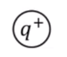

- Field model look like emanating from that charge , **lines are representing called the electric field due to this point charge. **

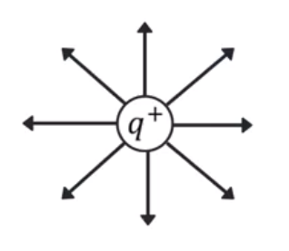

- Every one of these vector field lines is represented by the letter E. 
- The idea is that I've got a field, if I look outside of that source.
- I can think of permeating that entire space for infinity
- in a free space model that there's this electric field force that exist everywhere
- and they're all designated by this by this capital letter E with a vector sign on tap of it. 
- So the arrow that we see on top of the letter indicates that it is a vector quantity.

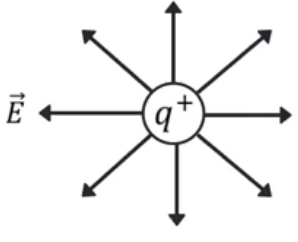

- What is the definition of Electric field ? 
- The definition of the electric field at any point in space is defined as the force exerted from the electric field. That force is a vector quantity itself. That's why the electric field gets its vector nature. That is imposed on a small test charge. So this $q_0$ is small in the sense that it's not going to contribute its own electric field to the distribution that you see coming from our q+ our source charge. 

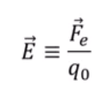

- The electric field, rather, is inferred from the force exertex on the charged objects in the vicinity of each other.
- Mathematical definition - 100 years of experiment - Michael Faraday 
- That have determined these characteristics of electric field and how they relate to charge.
- So what we're going to do is instead of calculating forces on neighboring charges due to point charges.
- We're going to write out the equation for the electric field.
- And the equation that we use for the electric field for a point source is going to be Q,

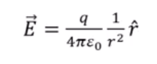

- So What does all this mean?
- And let's just make this, would be equivalent to our test chart. 

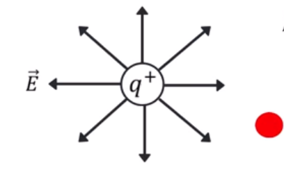

- The red circle, really is supposed to represent an infinitesimal point. 

- And what I'm saying here is that, if I think of the distance from the center of this point charge, to my observation point, 

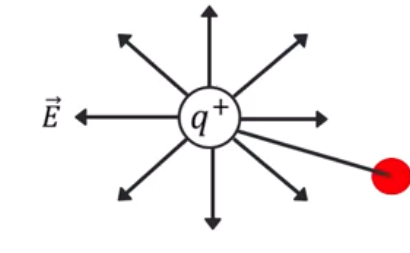

- I can represent that by the displacement r.


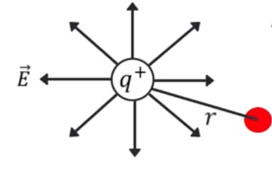

- And that's what this $r^2$ is in the denominator. 
- So the vector nature is comming from just the same unit vector that is defined by connecting the center of q+ to my observation point. 

- So one way to think of this is if I draw a little arrow here that is attached to the end of my displacement vector. 

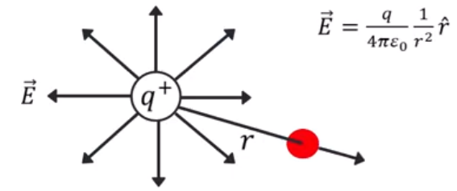

- This simply points the direction I'm going to put an $\hat{r}$ there.

- We just want to introduce the concept.

- So, what I can do is I can connect this letter $r$ here to the displacement. So that's in the denominator $r$ squared.

- If I move this observation point anywhere in this observation space, the displacement is going to move along with it and so will the direction of that unit vector. 

- So $\hat{r}$ is always pointing outward from the observation point to the area that to the location that we want to observe and calculate the electric field

---

## 2. Analytical model of a Point Charge - Part 2

This video lesson covers the concept of calculating the electric field generated by a point charge using mathematical equations and a cartesian coordinate system. It begins with exploring a straightforward example, where the electric field is calculated step-by-step using the equation covered in the previous lesson. Then the electric field value obtained from this calculation will be compared to Ansys Maxwell® advanced electromagnetic field solver simulation throughout the course.

- Let's go ahead and move the observation point intentionally choosing this first quadrant that you might be familiar with. So what I'm going to do is let's go ahead and draw a reference axis because we have to have a reference coordinate system.  

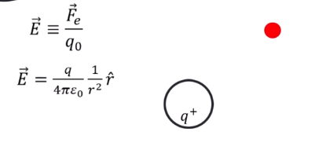

- So here I'll call this the Y axis and if I draw that little arrow I can go ahead and give this $\hat{y}.$

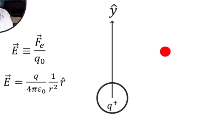

- You might be familiar with ijk as the coordinate reference is I'm going to go ahead and give it $\hat{Y}$.

- And then now I'm going to draw the X emanating from here. So just in two planes we'll do 3D probably later and of course this is the $\hat{X}$ direction. So now obviously

- this is a coordinate system that is centered directly on top of the source charge . 

- We don't have to do it that way but it works out incredibly convenient for what we're trying to do. 

- Now if I draw a R so this is coordinate X = 0, Y = 0. 

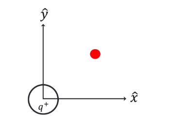


- So I'm drawing a line to my observation point and I'll try to make it clear that I'm looking at the middle of that observation point. That's pretty important. 

- So, I don't want to confuse anything with a discrete or I should say a finite size circle. 

- This should actually be a very specific unambiguous point but it makes more sense to draw that as a circle here. 

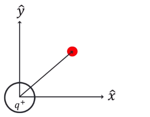


- This is my variable R. That's the displacement. 

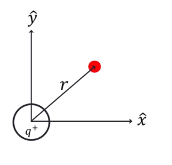

- The vector R is something that will determine in a second. So what I can do now is, if I look at my equation over here. so forget the definition. We're looking at the equation. 

- I can start to assign variable here and we'll go ahead and make a we'll go ahead and make an estimate of what this field is going to be. So a couple things we have to know what are the quantities? Well, the units that we are using right now are SI units, It's metric and we'll probably talk about that a little bit more in a subsequent session. 

- Q is the value of charge => q = 1C
- The permitivity of free space  $\epsilon_0 = 8.854 \times  10^{-12} \frac{C}{Vm}$

- So I'm not going to worry about the direction at the moment. So what I want to clarify here is over here on the right. I'll go ahead and go ahead and write out the magnitude symbol. So If I say, magnitude of the electric field as a function of r. 

- What that bascially means is that I want to ignore that vector nature of it. 

- And I'm only concerned about the impact of $r$ as the displacement. 

- So, If I write this out, just to be perfectly clear here. 

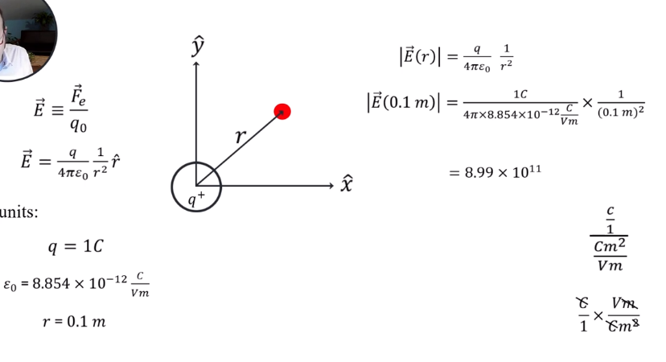

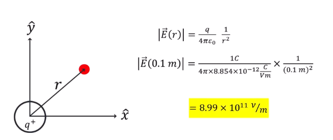

 

---

## 3. Overview of Ansys Electronic Desktop (AEDT)

### Step 1 : Click and Open - Ansys Electronic Desktop Software

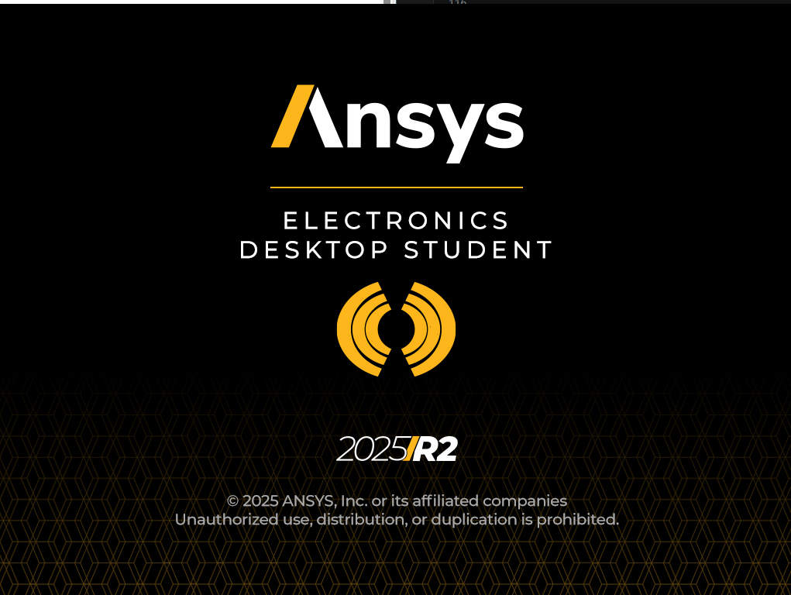

### Step 2 : Ansys Product Improvement Program

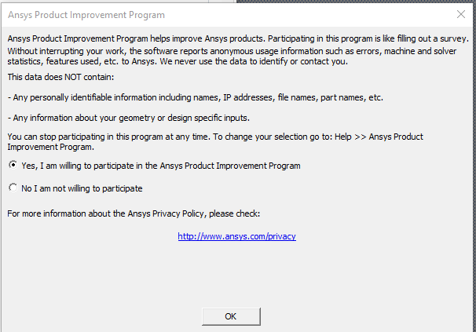

### Step 3 : Create New Project
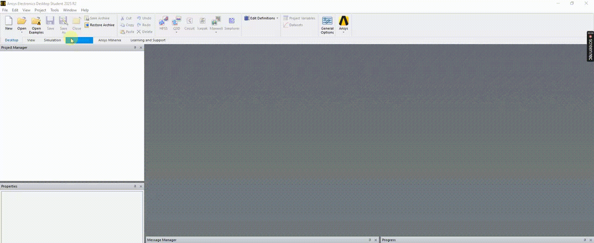

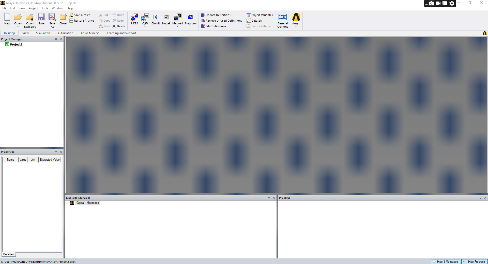

### Step 4 : Save the Project
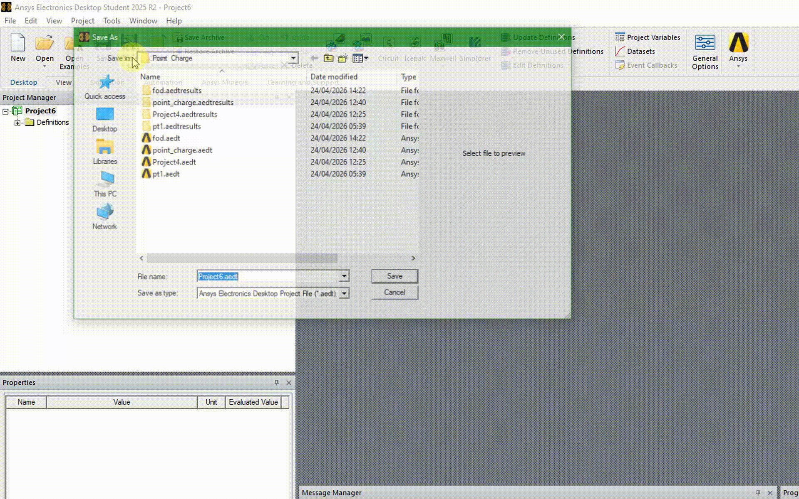


### Step 5 : Select Maxwell Icon in Toolbar - then Maxwell3D

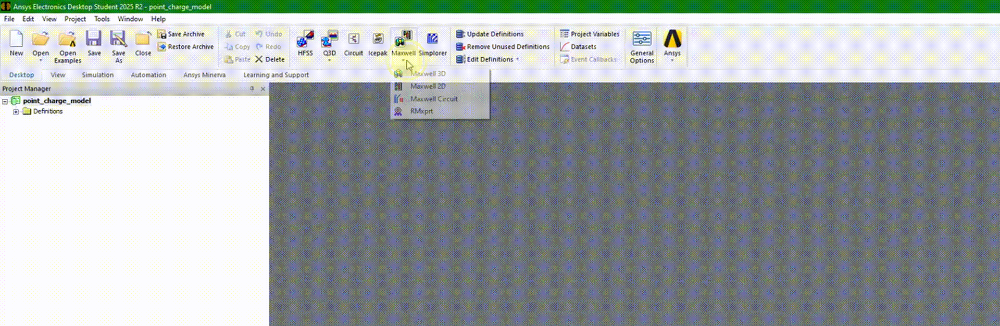


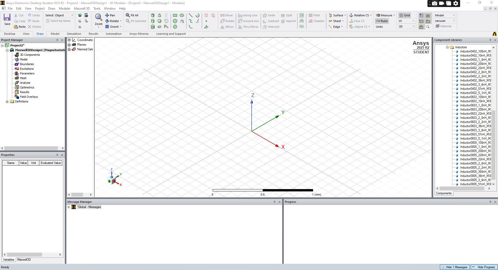


##  4. Geometry Creation & Materials

> This video lesson provides a detailed guide on replicating the analytical model discussed in previous lessons with a 3D model in Ansys Maxwell® advanced electromagnetic field solver. While the geometry used in this example is simple, the steps outlined here are applicable to more complex models encountered when applying simulation techniques to advanced engineering problems. It begins by creating a sphere at the origin, followed by a discussion on the hierarchical structure within the project manager window and history tree. Additionally, the lesson covers how to add the "air box" or region, which defines the solution space. It also covers how to assign material property and change the solution type in Ansys Maxwell software.

### Step 1 - Create a Sphere of 0.1 m

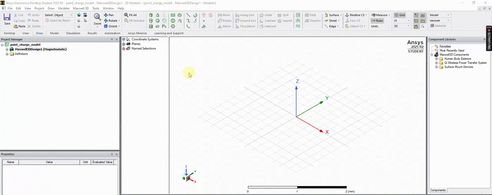

### Step 2 - Chage Solution Type from Magnetostatic to Electrostatic


### Step 3 - Create Region of 1 m


### Step 4 - Assign Material - Copper

**Note** : I able to run in Local Machine, for is Copper is not able to simulate, so using Vacuum only.

**Error** : ? 


---

## 5. Boundaries and Excitation

> This video lesson covers excitations and boundaries in Ansys Maxwell® advanced electromagnetic field solver. It focuses on floating and voltage excitations. It explains how the solution space is artificially limited to 500 mm while enforcing a zero-voltage condition at the boundary. This artificially truncates the “known universe.

### Step 1 - Sphere - Add Excitation - Floating - 1C

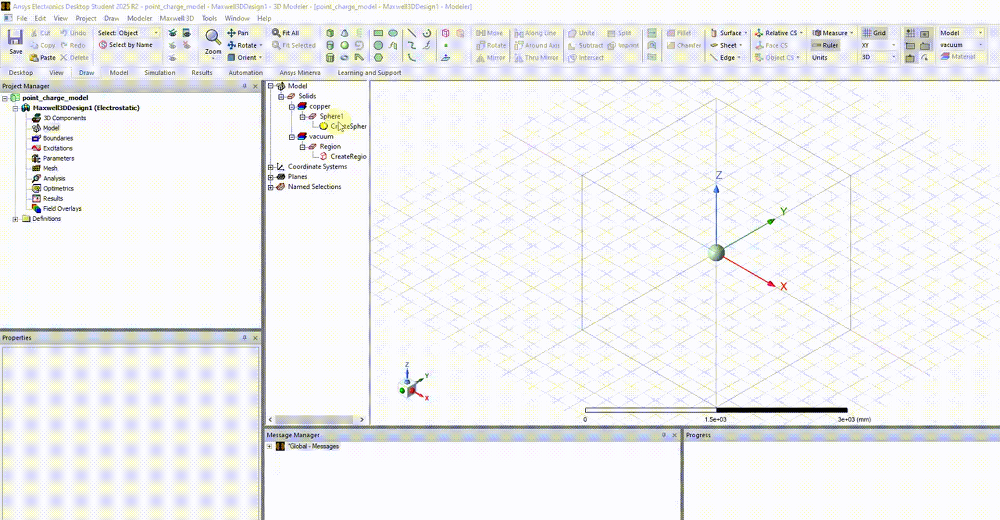


### Step 2 - From Object to Faces - Select Region > Selection Mode > Face 

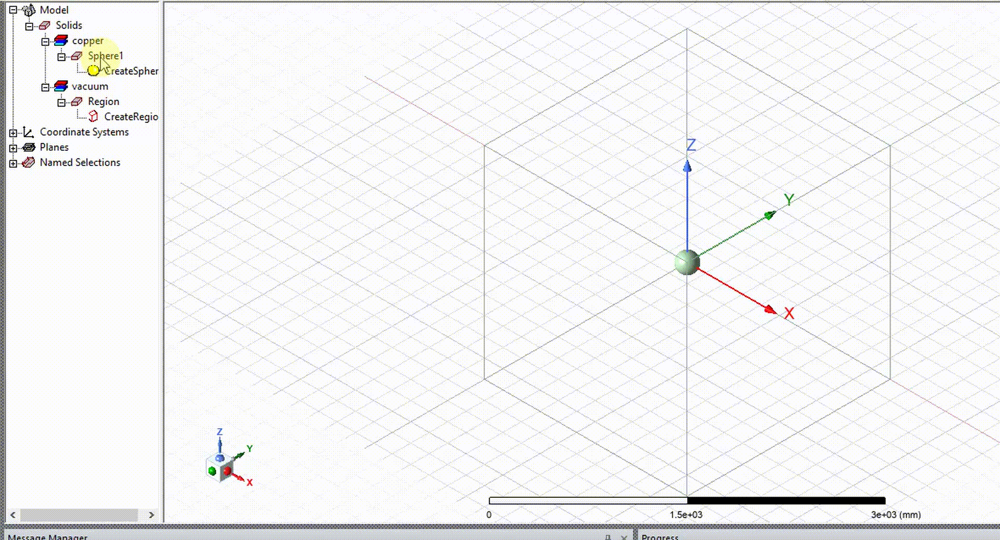


### Step 3 - Select Region > Extended Section > All Object Faces

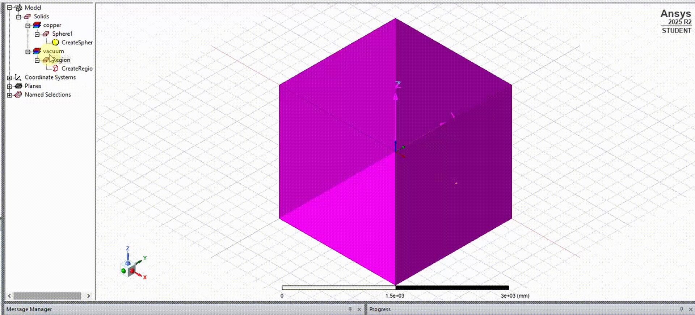


### Step 4 - Region - Add Excitation - Voltage - 0V

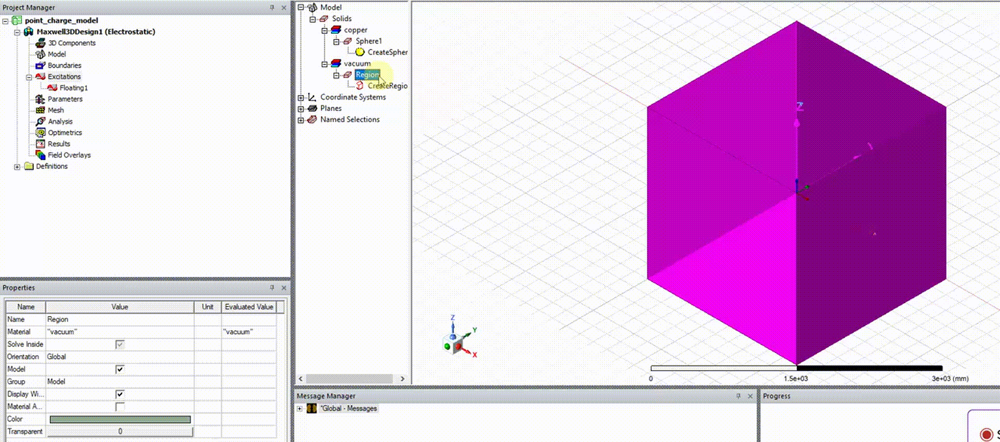


---

## 6. Setup and Analysis - Part 1

> This video lesson covers how to specify the solution setup and monitor the progress as it completes the adaptive solve process Ansys Maxwell® advanced electromagnetic field solver. Once the solution is finalized, it demonstrates how to generate a data table field report and evaluate the magnitude of the E field at the observation point. It also provides a comparison of the results obtained through simulation to an analytical estimate.

### Step 1 - Analysis - Setup

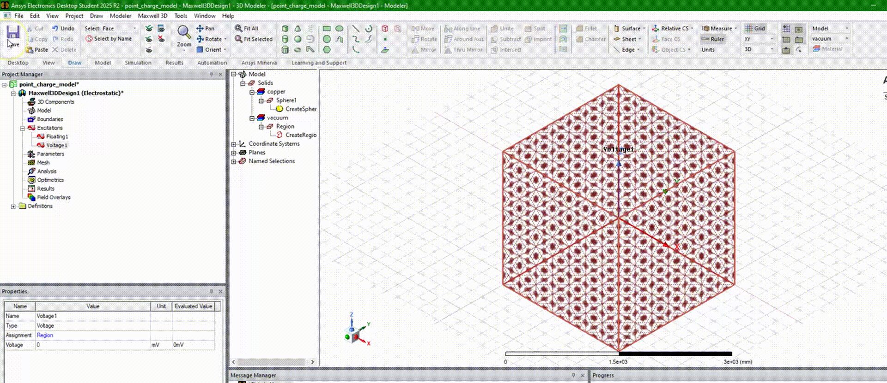


### Step 2 - Start to Analysis

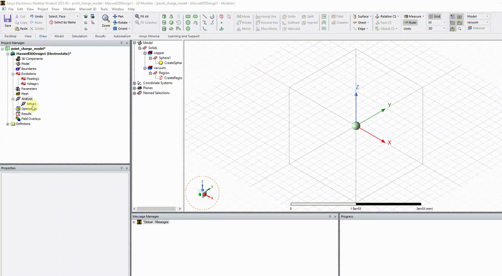


```error
*Global - Messages
  [info] GRPC server running on port: 50051. 
point_charge_model (E:/Point  Charge/)
  Maxwell3DDesign1 (Electrostatic)
    [info] Verify conduction path: Conduction path validate success. (03:28:52 PM  Apr 24, 2026)
    [error] Process '3des' terminated abnormally.  It may have run out of memory or could have been killed by the user. (03:28:58 PM  Apr 24, 2026)
    [error] Simulation completed with execution error on server: Local Machine. (03:29:00 PM  Apr 24, 2026)
```


### Step 3 - Change from Copper to Vacuum for Sphere

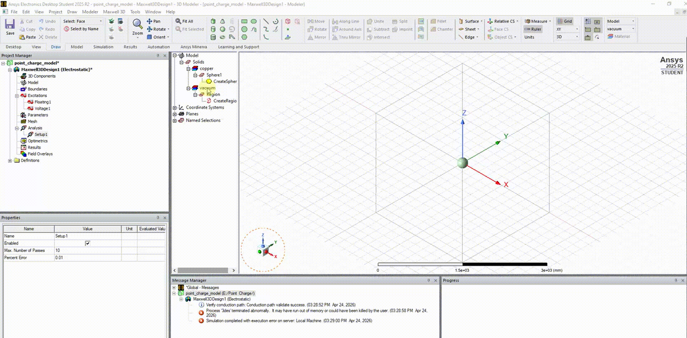


### Step 4 - Deleted the Sphere and Region

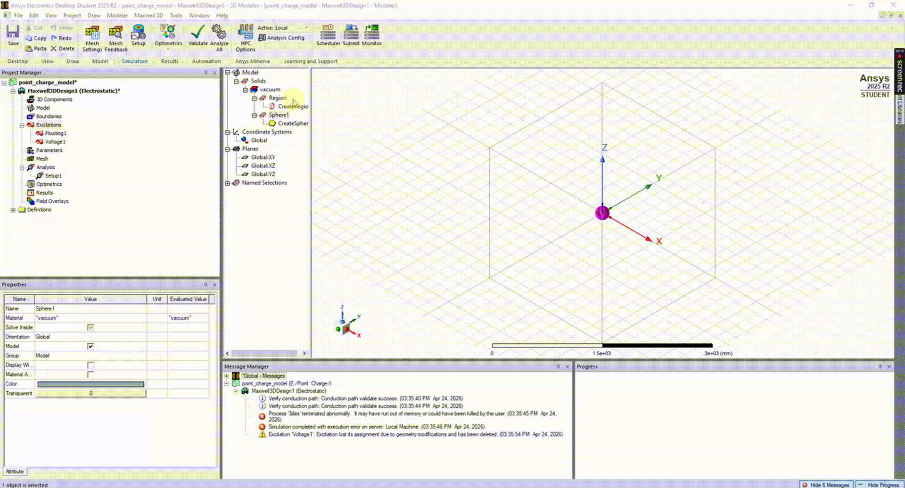


### Step 5 - Recreated the Sphere and Region in Vacuum, then Start to Analysis

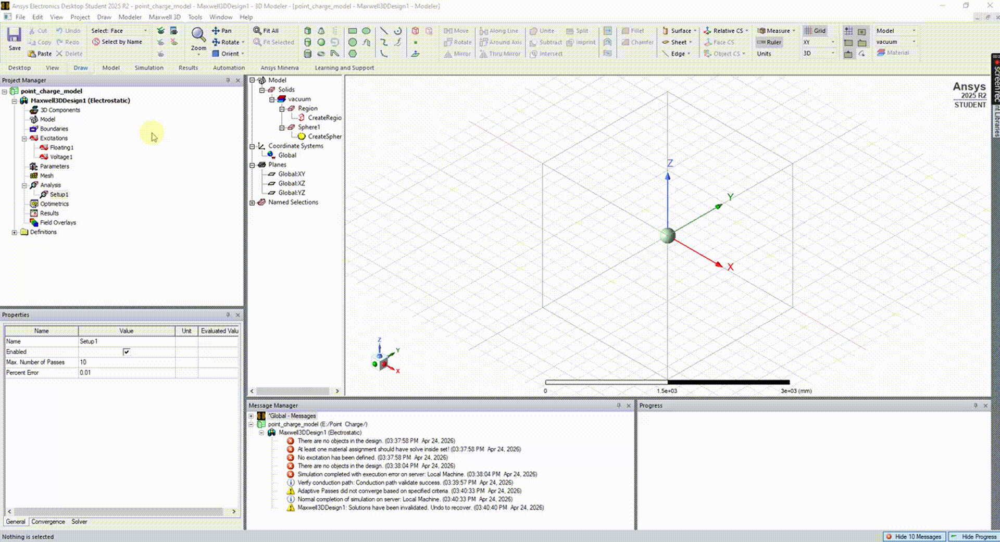


### Step 6 - Electric for the Point Charge of 0.1 m


### Step 7 - Look Around


### Step 8 - Create a Observation Point for Result.


### Step 9 - Result.

- This due to, I placed the observation point, on the surface, of the sphere. If you move away, it changes.
- Simulation Result = $8.96965 \times 10^{+11}$ v/m
- Calculated Result = $8.99e  \times 10^{+11}$ v/m

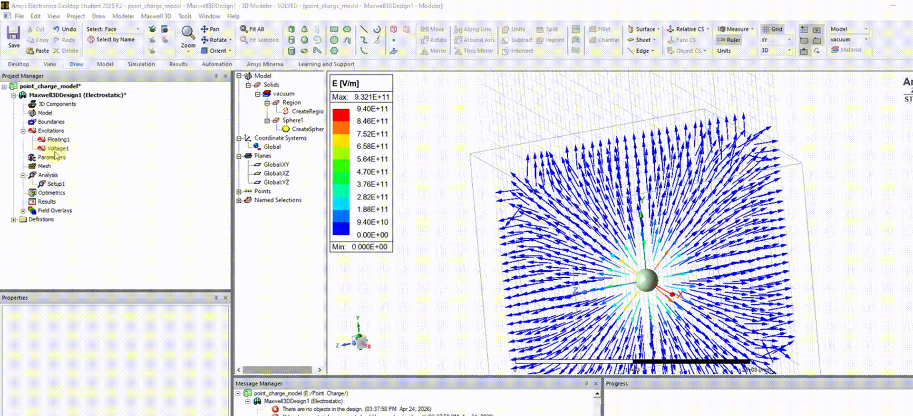


7. Setup and Analysis - Part 2

8. Data Table Report

9. Mesh and Field Plots

10. Example Problem - Part 1

11. Example Problem - Part 2
